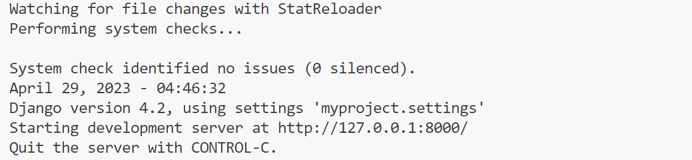
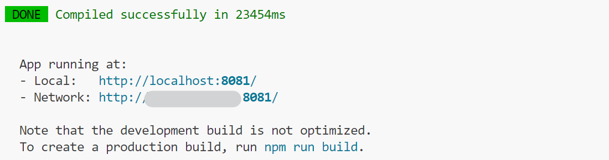

# Artifact

## Code structure
```sh
|-- llvm-project
	|-- compile.sh
	`-- clang
		|-- tools
			|-- CMakeLists.txt
			`-- code-transformer
				|-- code-transformer.cpp
				`-- CMakeLists.txt
`-- GNNPerf
	|-- backend
	|-- frontend
	|-- myproject
	|-- Process
		|-- compile.sh
		|-- execute.sh
		|-- support.h
		|-- Test_paper_fullgraph.sh
		`-- Test_paper_minibatch.sh
	|-- Projects
		|-- test_GAT_NC
		|-- test_GCN_NC
		|-- test_GIN_NC
		`-- test_SAGE_NC
	`-- Results
	
```


## Software dependencies 

We provide both source codes on Github and docker images

## Clone LLVM Clang

First, clone llvm.

- Choose a directory where you want the llvm directory (llvm-project) placed to prevent conflicts with existing llvm-project. 

- ```sh
  git clone --depth=1 https://github.com/llvm/llvm-project.git
  ```

- Overlay the llvm-project that you cloned into the folder of the llvm-project that contains code-transformer. 
- Ensure that folders llvm-project and GNNPerf are in the same directory as the above code structure shows.

In docker, we already clone llvm, but we did't build it in order to reduce the size of the docker. So if you use docker provided by us, you can start here. 

Then, Build clang and the code-transformer. 

```sh
cd llvm-project
mkdir build
cd build
cmake -DLLVM_ENABLE_PROJECTS=clang -DCMAKE_BUILD_TYPE=Release -G "Unix Makefiles" ../llvm
make clang
cd ..
./compile.sh
```

## Download Datasets

The datasets used in the experiments can be downloaded from https://drive.google.com/drive/folders/1lCzXHwIA9B3wMaJZ7dKiBJoayTIIGI0z?usp=sharing. 

Download the datasets and put it into the directory `GNNPerf/Process/datasets` as follows: 

```sh
`-- GNNPerf
	|-- Process
		|-- datasets
			|-- dgl_data
			|-- pyg_data
			|-- arxiv.graph
			|-- collab.graph
			|-- data_loader.py
			|-- DD.graph
			|-- ddi.graph
			|-- ppa.graph
			|-- ppi.graph
			|-- protein.graph
			|-- pubmed.graph
			|-- reddit.dgl.graph
```

## How to reproduce our results 

We conduct the experiments on a platform consisting of two Intel E5-2680 v4 CPUs and two NVIDIA A100 (40GB memory) GPUs. 

The original GUL codes used in the experiments are in GNNPerf/Projects, including test_GAT_NC, test_GCN_NC, test_GIN_NC, and test_SAGE_NC. And the auto-test scripts are GNNPerf/Process/Test_paper_fullgraph.sh and GNNPerf/Process/Test_paper_minibatch.sh. 

Use either the scripts or the visualization tool to reproduce our results and see the results with the visualization tool. 

#### Use the scripts

Go to the directory GNNPerf/

```sh
cd GNNPerf/
```

Run the full-graph training test

```sh
./Process/Test_paper_fullgraph.sh
```

Run the mini-batch training test

```sh
./Process/Test_paper_minibatch.sh
```

#### Use the visualization tool

The visualization tool is based on Django version 4.2 and node.js version 16.14. which are contained in the docker. 

Start the backend of the visualization tool.

```sh
cd GNNPerf
python manage.py runserver
```

If run successfully: 



Start the frontend of the visualization tool.

```
cd GNNPerf/frontend
nvm use 16.14.0
npm run serve
```

If run successfully:



Open the local URL to use the visualization tool. 